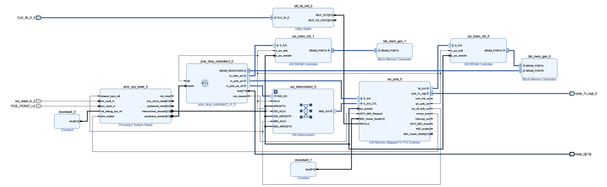

# KC705_pci_driver
Very simple pci-express driver for my FPGA board

This is just a very simple driver. It's not specific to the KC705 board, and could be used with any other as long as the hardware IDs in the .inf file match the ones in the FPGA's config space.

Feel free to reuse, no license, I don't care.

# Tips for driver development
A few issues I ran into for those new to driver dev.
- As of now 03/2022, the WDK doesn't have backward compatibility anymore. You need to install a version that is older than your windows version. If you don't,
you gonna get an error when trying to setup auto provisioning on your target computer. The Windows Driver Test Framework won't install, without an obvious message and it's a pain
to investigate.
- I had an error when trying to attach the debugger to the kernel on my remote computer that said "Debugger extension error" or whatever. Didn't manage to solve that. VS reinstall
didn't solve it. In the end I just installed VS in a VM, and debugged from the VM to the remote computer, it works fine.
- For some reason, the debugger doesn't load the driver pdb on its own because the path is not added to the symbol path. One way to solve it is to use ".sympath+ <folder>" in
the debugger immediate window. There are other solutions for sure.
- pnputil is a life saver a lot of the time. It's a utility to do a lot of usefull stuff with PNP devices. You can enumerate them, desinstall the driver, disable a device,
restart a device etc... just remote into your target computer and use pnputil in an admin command prompt.
- It seems like auto provisioning is unable to uninstall the driver a lot of the time (Maybe because of PnpLockdown ?). pnputil can help here too. Didn't find a satisfying solution yet.

# FPGA design
I originally wanted to use system-mode DMA because it simplifies the design quite a bit, but I had trouble making it work. The documentation states that it's available for SOC, so I'm not sure if that is possible with x86. Anyway, right now the design looks as follow. There is no DMA for now, just memory mapped registers.
  

  
Register map:  
| Address      | Description |
|--------------|:------------|
| 00000000 |  leds, only the 1st byte is meaningfull |
| 00000004 |  DMA src address high  |
| 00000008 |  DMA src address low  |
| 0000000C |  DMA dst address high  |
| 00000010 |  DMA dst address low  |
| 00000014 |  DMA length  |
| 00000018 |  DMA status  |
| 00000020 - 000001FC |  unused  |
  
The DMA registers are not used for now. 
  
# Vivado project
The hardware design is located in KC705_pci_hardware. It is shared in the form of a tcl script that regenerate the project.
Just run "source pci_test.tcl" in a tcl command prompt to regenerate it. To update it use vivado File -> Project -> Write tcl, then remove absolute paths in the tcl file. 
